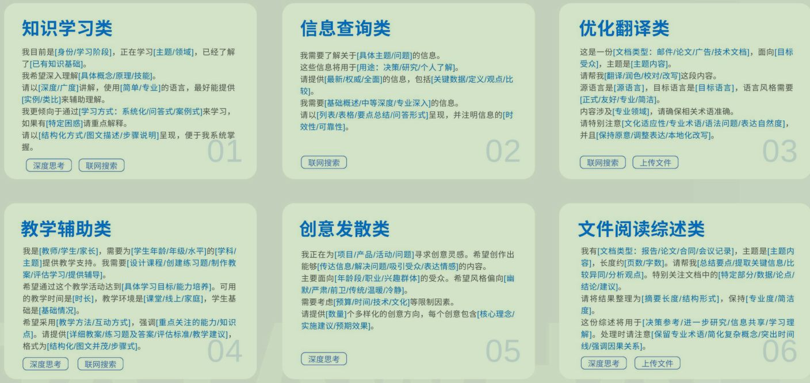
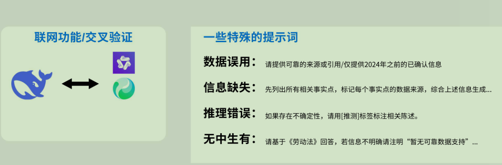
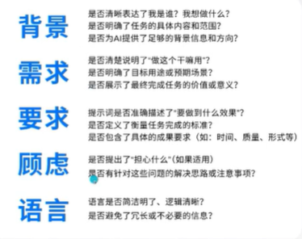

# AI
环境工具:

```
anaconda 安装 https://mirrors.tuna.tsinghua.edu.cn/anaconda/archive/
```

资源:

```
1. https://github.com/microsoft/AI-For-Beginners/blob/main/translations/zh-CN/README.md
2.https://www.datawhale.cn/home
3.https://roadmap.sh/ai-engineer

https://zhuanlan.zhihu.com/p/1940862894200829672
```


AI 使用

```
1. 当AI回答之后，继续点再生按钮， 可以继续生成多种新的回答。  适合发散性的提问。
2. 当ai回答不符合逻辑时，新建对话重新提问。

3. 提问模板:  
	1.交待背景。信息越详细越好。
	2.需求，  需求量化明确。
	3.要求。   完成的各种要求。
	4.顾虑。   担心的点。
	
我的示例
交代背景：
我喜欢读书，大概每天阅读30分钟，喜欢的书籍类型有历史， 经济， 科学， 计算机。 我深知读书的意义，可以充实自己的灵魂，不至于遇到事情不止所措。
需求：
明天要参考读书会，请帮我写一份1分钟的自我介绍，需要展现我的特点。 
要求：
需要控制时间1分钟，文字不要太生硬，可以引用一些典故或者名言。 
顾虑：
不要太张扬，要随和。

ai回答：
	大家好，我是[你的名字]。很高兴能加入这个读书会，终于找到一群可以一起分享阅读乐趣的朋友了。

我特别喜欢苏东坡的一句话：“**腹有诗书气自华**。”对我来说，读书不是为了在人前炫耀，而是一种日课，一种滋养。每天我都会雷打不动地留出半小时，翻几页书，这已经成了我生活里最舒服的“充电”时刻。

我看书比较杂，主要在四个领域里来回探索：读**历史**，像是拿到了一份人类经验的错题本，让我明白凡事皆有因果；读**经济**，试着看懂世界这台复杂机器是如何运转的；读**科学**，能体会到一种纯粹的理性之美；而读**计算机**的书，则让我这个从业者能不断回归技术的底层逻辑。

书本给我的知识是“骨架”，但更重要的是，它们填充了我的“灵魂”，让我在面对生活和工作中的难题时，心里有底，手里有据，不至于惊慌失措。

我期待在接下来的分享中，能从大家这里听到更多不同的视角，让我们的书架和思想都丰富起来。谢谢大家。
```

几种ai常用场景 提问模板:



```
ai 怎么 去除ai味：
	1. 拆解问题为小问题
	2. 让ai  ‘说人话’
	3. 给ai示例，让它按照某种风格
	
减少ai模型幻觉：	
```



提示词优化：

